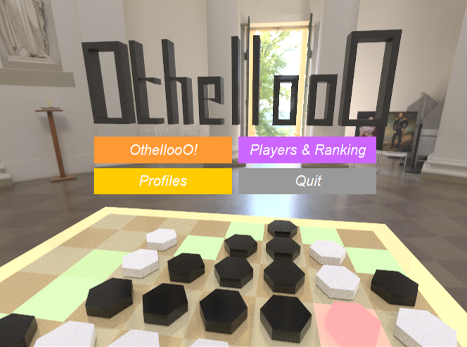

# OthellooO

使用 Java、Swing 与 LWJGL 框架实现的三维黑白棋（翻转棋）游戏。除游戏主逻辑外包括存档管理、玩家管理、人机对战、悔棋、回放、个性化主题色等功能。

图形框架使用 LWJGL，在片段着色器中实现光线追踪、PBR 材质、Hdr 背景，以及八叉树、重要性采样等优化。

## Acknowledgment

具体实现参考成分较多，主要参考来源如下：

GPU 光线追踪参考: [https://blog.csdn.net/weixin_44176696/article/details/119044396](https://blog.csdn.net/weixin_44176696/article/details/119044396)

BRDF 参考: [https://blog.csdn.net/weixin_44176696/article/details/119791772](https://blog.csdn.net/weixin_44176696/article/details/119791772)

Hdr 读取使用: [https://github.com/Ivelate/JavaHDR](https://github.com/Ivelate/JavaHDR)

Hdr 图片来自: [https://polyhaven.com/hdris](https://polyhaven.com/hdris)

人机对战 AI 棋手部分来自 [@Maystern](https://github.com/Maystern)

## Screenshots

&nbsp &nbsp

&nbsp &nbsp

&nbsp &nbsp

